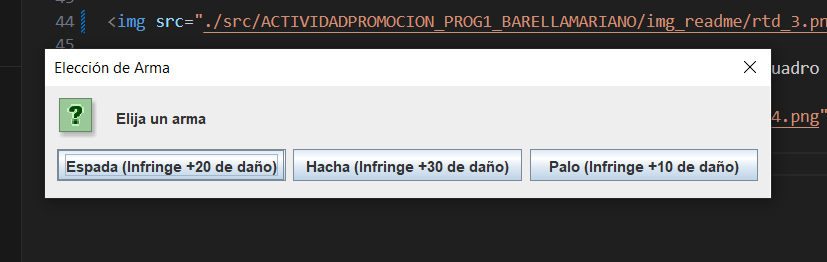
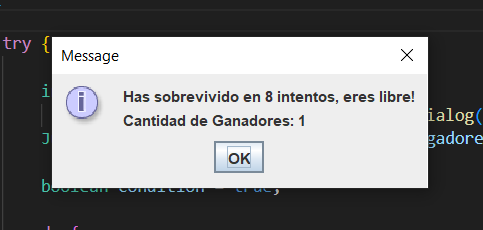

# Roll The Dice - Introducción

Bienvenido/a a Roll The Dice, videojuego en creado para la materia Programación 1, perteneciente a la carrera TUDAI del Instituto Universitario Aeronáutico Córdoba. Roll The Dice es un juego de tipo RPG (Role Playing Game), donde el usuario puede elegir entre 3 razas (Cada una con sus propias características) para luchar contra un monstruo y poder escapar del calabozo en el que se encuentra. La posibilidad de atacar va a estar dada por la tirada de un dado. Este videojuego ha sido creado en Java, para mostrar el conocimiento alcanzado con respecto a los pilares del lenguaje. 

## Modo de Juego 

- En primer lugar, deberá ingresar en el cuadro de diálogo la cantidad de jugadores. En caso de no ingresar un número entero, el sistema le notificará que debe hacerlo.

- Luego de ingresar la cantidad de jugadores, iniciará el programa principal mostrando el menú de opciones, a saber:

1. "Comenzar Juego": Eligiendo esta opción, da lugar a que el programa
comience su funcionamiento. Por cada jugador, deberá ingresar un nombre,
además de elegir la raza. Cabe destacar que cada raza posee armas y/o
ataques con distintas cualidades.

2. “Listar Jugadores”: Esta opción despliega la información de cada uno de los
jugadores ingresados.

3. “Mostrar Ganadores”: Aquí se muestran solamente aquellos jugadores que
hayan logrado vencer al monstruo, asi como la cantidad de intentos en los
que lo hicieron. Esto se logra ingresando al atributo de tipo boolean “ganó”
mediante su correspondiente getter.

4. “Ver Ganador (Por menos intentos)”: Mediante un método de la clase
demoRPG denominado ordenarGanadores, que trabaja con un algoritmo de
ordenamiento de tipo bubble, se ordenan los jugadores teniendo en cuenta
la cantidad de intentos que les llevó completar el juego. Una vez ordenado,
se encuentra mediante búsqueda secuencial aquel jugador que haya
ganado, y que a la vez posea la menor cantidad de intentos.

5. “Listar Jugadores por Raza”: Este es un informe personalizado que
determina mediante instanceof a qué raza corresponde cada jugador, y
devuelve la cantidad de jugadores que corresponden a cada una de las 3
razas del juego (Guerrero, Mago, Orco).

# Prueba de Juego

- Al hacer click en "Comenzar Juego", aparece un cuadro de tipo option para que el jugador elija entre los 3 distintos tipos de raza posibles: 

- Una vez elegida la raza, el jugador debe ingresar su nombre en el cuadro de diálogo: 

- Cada raza posee distintas armas, las cuales pueden variar el daño que le causan al monstruo. En el ejemplo siguiente hemos elegido la raza guerrero, y como **arma** su espada, que causa +20 de daño al monstruo al sacar 4 o más en el dado:

- Se da inicio al juego con un mensaje para contextualizar a los jugadores: 

- Como se explico al inicio, el lanzamiento de un dado al azar, genera la interacción entre el usuario y el programa. Cada vez que se lanza este dado, un mensaje de información le aparece en pantalla al usuario: 

- El valor del dado se imprime en pantalla: 
  

- En el caso que el valor del dado sea 3 o menor a 3, se imprime un mensaje en pantalla detallando el daño causado al jugador, y mostrando la salud actualizada tanto del jugador como del monstruo: 

- En el caso que el valor del dado sea 4 o mayor, imprime un mensaje en pantalla detallando el daño causado al monstruo, y mostrando la salud actualizada tanto del jugador como del monstruo, tal como se ejemplifica en las siguientes imágenes: 
  

## Derrota Jugador
- En el caso en que la salud del jugador llegue a 0, el jugador pierde y se le notifica que ha sido derrotado: 

# Victoria Jugador

- En el caso en que la salud del monstruo llegue a 0, se le notifica al jugador mediante los siguiente mensajes en pantalla: 

- Cabe destacar que también se notifica la cantidad de ganadores hasta el momento: 

